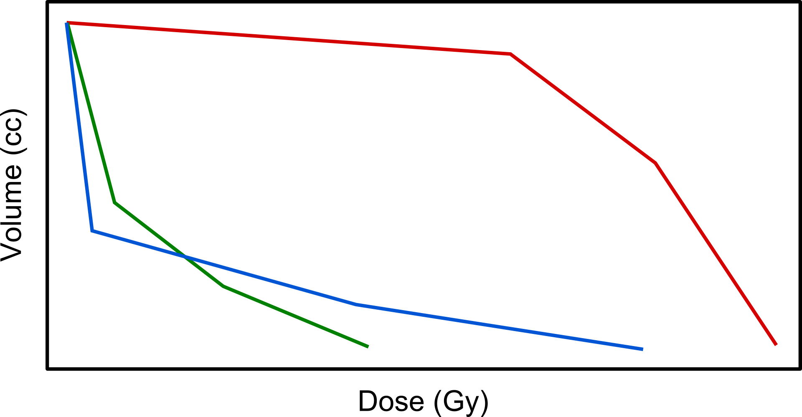

Introduction
============
 
This is a word in *italics* and this is in **bold**.
The following is a list of numbered items or steps:
 
#. Do the first thing.
#. Do the second thing.
 
Here is a bulleted list:
 
* Thing 1
* Thing 2
 
Images
------
 
Here's how you include an image.
 

 
   Here is the figure caption.
 
.. _references:
    
References
----------
 
You can reference different parts of a document (even across files)
by labeling it, as done in this section, and reference it like this:
:ref:`references`.
 
Math
----
 
You can include complex math using LaTeX syntax:
 
.. math::
    
   E(p) = \frac{1}{Y} \sum\limits_{j=1}^{m} y_j E(f_j)
 
which is rendered on its own line, but you can include
inline math like this: :math:`m = 10`.
